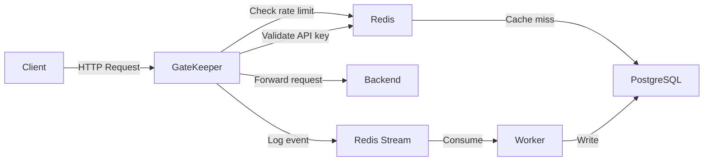

# GateKeeper .NET 10 API Gateway

**GateKeeper** is a lightweight, self-hosted API Gateway built with **.NET 10**. It sits in front of your backend services and handles authentication, rate limiting, request logging, and analytics — so your services don't have to.

> Inspired by Kong, AWS API Gateway, and WSO2 API Manager — built from scratch to understand what happens under the hood.

---

## Features

- **Config-driven reverse proxying** — add routes in `appsettings.json`, no code changes needed
- **API key authentication** — validates `X-Api-Key` header with sub-millisecond Redis TTL cache
- **Sliding window rate limiting** — atomic Lua scripts on Redis Sorted Sets, per-key tiered limits (free/paid)
- **Async request telemetry** — Redis Streams pipeline decouples logging from the hot path
- **Background consumer worker** — batch processes stream events and writes to PostgreSQL
- **Real-time analytics dashboard** — React + TypeScript UI showing request volume, error rates, latency distribution, and per-key usage

---

## Architecture



---

## Request Flow

Every request passes through the following middleware pipeline in order:

```
Incoming Request
      │
      ▼
┌─────────────────────────────┐
│  AsyncLoggingMiddleware     │  Starts stopwatch, pushes log event to
│                             │  Redis Stream after response completes
└─────────────┬───────────────┘
              │
              ▼
┌─────────────────────────────┐
│  SlidingWindowRateLimiter   │  Checks per-key request count using
│                             │  atomic Lua script on Redis Sorted Set
│                             │  → 429 Too Many Requests if exceeded
└─────────────┬───────────────┘
              │
              ▼
┌─────────────────────────────┐
│  ApiKeyAuthentication       │  Validates X-Api-Key header
│                             │  Redis cache hit → <1ms
│                             │  Cache miss → PostgreSQL query
│                             │  → 401 Unauthorized if invalid
└─────────────┬───────────────┘
              │
              ▼
┌─────────────────────────────┐
│  ReverseProxyMiddleware     │  Matches path to configured route
│                             │  Forwards request to backend
│                             │  Returns backend response to client
└─────────────────────────────┘
```

---

## Performance — k6 Load Test Results

Load tested with **10 Virtual Users** over a **30-second steady load** scenario.

| Metric | Value |
|:---|:---|
| **Throughput** | **93.78 req/sec** |
| **P50 Latency** | **1.94ms** |
| **P90 Latency** | **2.26ms** |
| **P95 Latency** | **3.00ms** |
| **Requests passed (200 OK)** | 100 |
| **Requests blocked (429)** | 2,718 |
| **Server errors (500)** | 0 |

**Key highlights:**
- 95% of requests completed in under **3ms** including auth + rate limit checks
- Rate limiter allowed exactly 100 requests (configured limit) and blocked all remaining burst traffic
- Zero server errors under sustained concurrent load

---

## Tech Stack

| Layer | Technology |
|:---|:---|
| Gateway | .NET 10, ASP.NET Core |
| Database | PostgreSQL 17, Entity Framework Core |
| Cache & Queue | Redis 7, StackExchange.Redis |
| Rate Limiting | Redis Sorted Sets + Lua scripts |
| Async Pipeline | Redis Streams (XADD / XREADGROUP / XACK) |
| Frontend | React, TypeScript, Tailwind CSS, shadcn/ui |
| Charts | ApexCharts, Recharts |
| Testing | xUnit, k6 |
| Container | Docker, Docker Compose |

---

## Getting Started

### Prerequisites
- [Docker Desktop](https://www.docker.com/products/docker-desktop/)
- A backend service to proxy to

### 1. Clone the repository
```bash
git clone https://github.com/udarapiumal/API-Gateway.git
cd API-Gateway
```

### 2. Configure your routes

Edit `appsettings.json` and point routes to your backend services:
```json
"Routes": [
  {
    "Path": "/products",
    "Target": "http://your-backend:8080/api/products"
  },
  {
    "Path": "/orders",
    "Target": "http://your-backend:8080/api/orders"
  }
]
```

### 3. Add your API keys

After the gateway starts, insert API keys into PostgreSQL:
```sql
INSERT INTO "ApiKeys" (id, owner, tier)
VALUES (
  '550e8400-e29b-41d4-a716-446655440000',
  'my-service',
  'free'
);
```

### 4. Start the gateway
```bash
docker-compose up --build
```

Gateway will be available at `http://localhost:7097`.

### 5. Make authenticated requests
```bash
curl -H "X-Api-Key: 550e8400-e29b-41d4-a716-446655440000" \
     http://localhost:7097/products
```

---

## Rate Limiting

Rate limits are configured per path in `appsettings.json`:

```json
"RedisRateLimits": [
  {
    "Path": "/products",
    "Window": "60s",
    "MaxRequests": 100
  }
]
```

When a key exceeds its limit the gateway returns:
```
HTTP/1.1 429 Too Many Requests
Retry-After: 60

Rate limit exceeded. Try again later.
```

---

## Analytics Dashboard

The gateway includes a real-time React dashboard accessible at `http://localhost:5173`:

- **Stats bar** — total requests, avg response time, error rate, active API keys
- **Request volume** — line chart of requests per minute (last 60 min)
- **Status codes** — donut chart showing 200/429/401 distribution
- **Response time distribution** — bar chart of latency buckets
- **Top paths** — table with request count, avg latency, error rate per route
- **API key usage** — per-key request count, avg latency, last seen
- **Live request feed** — real-time scrolling log of recent requests

---

## API Endpoints

### Gateway (proxied routes)
```
GET /products     → proxied to configured backend
GET /orders       → proxied to configured backend
```

### Analytics Dashboard
```
GET /api/dashboard/summary       → total requests, avg ms, error rate, active keys
GET /api/dashboard/timeseries    → request volume per minute (last 60 min)
GET /api/dashboard/statuscodes   → request count grouped by status code
GET /api/dashboard/paths         → top paths with request count and error rate
GET /api/dashboard/apikeys       → API key usage with last seen timestamp
GET /api/dashboard/recent        → last 20 requests
GET /api/dashboard/distribution  → response time distribution buckets
```

---

## Running Tests

```bash
cd ReverseProxy.Tests

# Unit tests only (no dependencies needed)
dotnet test --filter "FullyQualifiedName~UnitTests"

# Integration tests (Redis + PostgreSQL must be running)
dotnet test --filter "FullyQualifiedName~IntegrationTests"

# All tests
dotnet test
```

### Load testing with k6
```bash
k6 run loadTesting.js
```

---


## Contributing

Pull requests are welcome. For major changes please open an issue first to discuss what you'd like to change.

---

*Built as a portfolio project to demonstrate system design concepts: caching, rate limiting, async pipelines, and observability.*